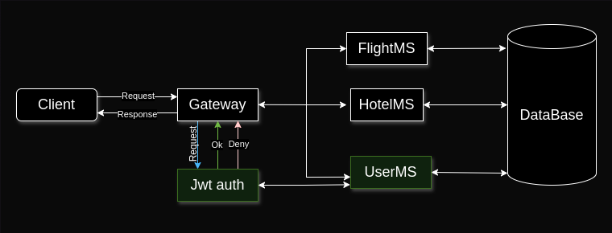
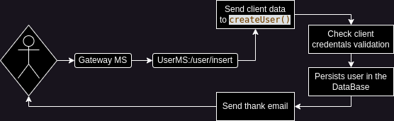

# L-Airline API Rest Project: JWT authentication and User Microservice.

 In this microservice, I implemented the JSON Web Token Authentication methods
with a custom configuration to manage the authorization by roles.



I implemented JWT authentication in this microservice to develop this efficiently and create two different microservices. 

## User
Have the following data: id, name, email, role and password, being email the unique identifier.

## JWT
Use the email, role and 15-minute validation to authorize (or not) who makes a request to some endpoint.

## MailSender
It's configured with the GMail implementation to send a thanked message to everyone who registers, making an HTML format.

Sending thank message life cycle:



The client connects with User Microservice through Gateway in /user/insert endpoint. Send his data, and it goes to createUser() UserService's method, the user persists if his data is validated, and gets a thanked email in his email address.

## Security configuration

### Password
The user's password is encrypted with BCrypt default security level. 

### User login credentials validation
Use the user's email like unique identifier to search in the database (and throw a custom exception when can't find), find in the DataBase the matching with the email, hash and compare the login password to get authorization or throw an exception.

## Exception Handling
Create custom exceptions and handle all exceptions than the project can throw (or I know that can throw), and use the ResponseEntity interface to return a friendly, understandable and explicit message.

## Docker implementation
The docker-compose-yml file makes an all L-Airline Microservices project orchestrated initialization. How you can see in the following example:

```yaml
  servicex:
    image: lautaromvillalba/servicex
    container_name: x
    depends_on:
      - servicey
    environment:
      - eureka.client.serviceUrl.defaultZone=http://eureka:xxxx/eureka/
      - spring.cloud.vault.token= ${TOKEN}
    ports:
      - "0000:0000"
    networks:
      airline_net:
```
The project's services use three key factors to work out:
### Eureka URL
Use a customizable parameter to communicate which server/port Eureka location will be used. 
### Vault Token
This is an environment value that is set in a local folder.
These makes secured the Vault Connection and doesn't expose the Token Root Login.
### Customized Network
This network helps the services to be in a common environment,
helping to the Eureka Server connection and communication.

## You want to know how to run the docker-compose.yml? Go to
[How to use L-Airline docker-compose](https://github.com/LautaroMartVillalba/L-Airline-DockerCompose)